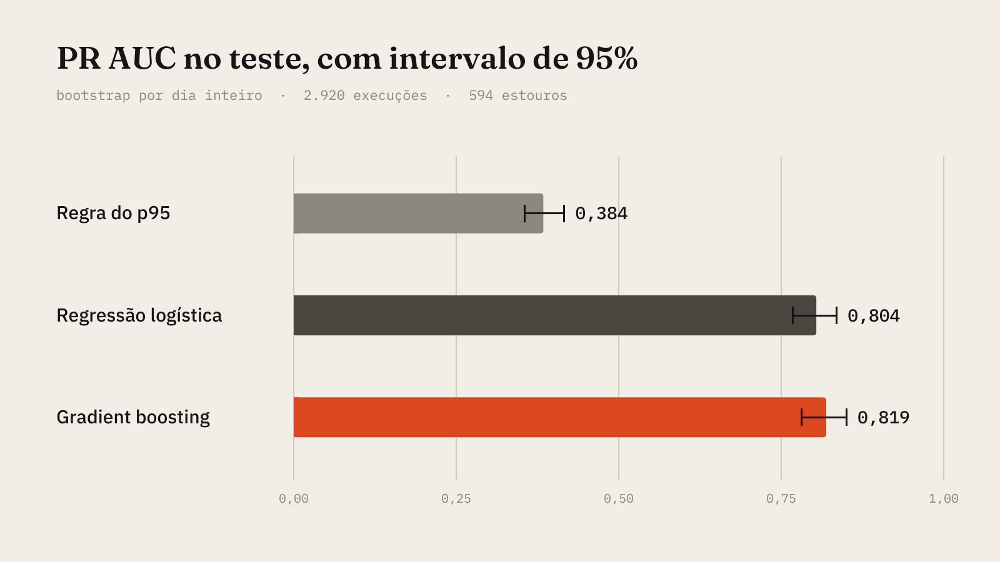
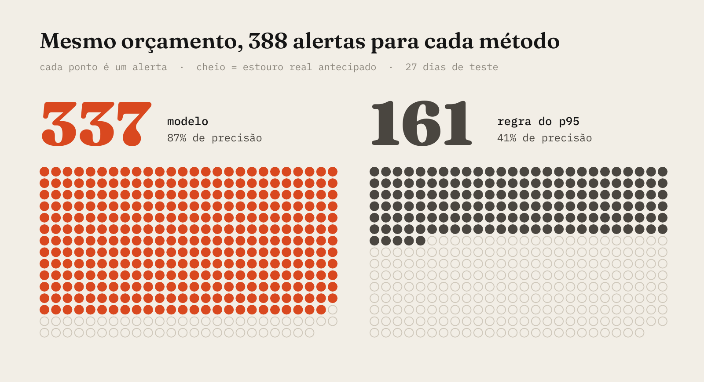
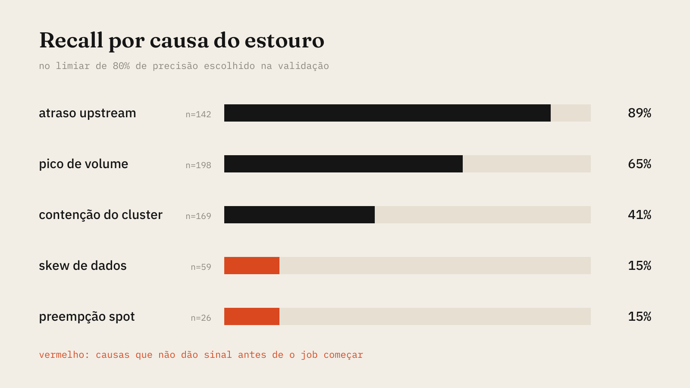

# O SLA estoura antes de o job começar

Em plataforma de dados, o ritual costuma ser o mesmo. Alguém abre o dashboard às nove da manhã, o número está com cara de ontem, e começa a arqueologia: qual job atrasou, desde quando, quem depende dele. Quando o chamado chega ao time de plataforma, o prazo já passou faz tempo. Sobra explicar.

O que me incomodava nesse ritual é que, na maioria das vezes, o atraso era previsível. O upstream já tinha chegado tarde, o volume do dia era o dobro do normal, o cluster estava engasgado desde a madrugada. A informação existia no momento em que o orquestrador liberou o job. Ninguém estava olhando para ela com essa pergunta.

Então fiz o teste. Montei um dataset, treinei um modelo pequeno e publiquei tudo aberto para quem quiser reproduzir ou provar que estou errado.

Modelo: https://huggingface.co/julianoxdd/sla-breach-early-warning
Dataset: https://huggingface.co/datasets/julianoxdd/batch-sla-runs
Código: https://github.com/julianodutraa/sla-early-warning

## A regra do p95 e seus 71% de ruído

Quase todo mundo protege SLA com a mesma regra, escrita numa tarde e nunca mais revisada: soma o atraso do upstream ao p95 histórico do job e compara com a folga até o prazo. Passou, alerta.

É uma regra honesta e fácil de defender numa reunião. O problema aparece no plantão. O p95 já é um cenário pessimista, e somá-lo ao atraso do dia faz a regra gritar em muita execução que ia terminar a tempo. No meu mês de teste ela disparou 1.319 vezes e acertou 29%.

Sete alarmes falsos em cada dez. Qualquer pessoa que já segurou um pager sabe o que acontece depois disso: o canal vira ruído, alguém cria um filtro, e o alerta verdadeiro morre junto com os falsos.

## Mudar a pergunta

Em vez de "este job está atrasado?", a pergunta passou a ser: no instante em que o orquestrador libera o job, qual a probabilidade de ele terminar depois do prazo?

A restrição que dá sentido a isso é dura. Tudo o que só se sabe depois da execução fica fora: runtime real, espera efetiva na fila, a causa do atraso. O modelo só enxerga o que existe antes de o job começar. Volume de entrada e a razão contra a mediana dos últimos sete dias. Quanto as dependências já atrasaram. CPU do cluster, profundidade da fila e jobs concorrentes. O histórico recente do próprio job e a folga que o SLA dá.

A recompensa é que o aviso chega com a folga inteira pela frente. Dá tempo de subir executores, reordenar a fila, cutucar o dono do upstream ou avisar o consumidor antes que ele descubra sozinho.

## Por que dados sintéticos

Log de orquestrador real quase nunca sai de empresa, e quando sai não traz o motivo de cada atraso. Para comparar métodos de forma justa eu precisava conhecer o mecanismo por trás dos dados, então escrevi um gerador com semente fixa.

São 19.440 execuções de 60 jobs ao longo de 180 dias. O runtime de cada execução multiplica o tempo base do job pelo volume elevado a uma elasticidade própria, por um fator de contenção que cresce quando a CPU passa de 70% e por um ruído lognormal. Por cima disso entram eventos rotulados: picos de volume em 4% das execuções, atraso upstream em 12%, skew de dados, mais comum depois de mudança de schema, e preempção de instância spot, mais comum com o cluster cheio. Há sazonalidade semanal e de fim de mês e uma erosão lenta de capacidade ao longo do semestre, que faz a taxa de estouro subir com o tempo. No fim, 19,5% das execuções estouram.

Isso tem um preço, e volto a ele no final.

## Como eu tentei não me enganar

Modelo de operação costuma brilhar na validação e decepcionar na segunda de manhã. Quase sempre é vazamento. Então a divisão é por tempo: 70% da linha do tempo para treino, 15% para validação, os últimos 15% para teste. O histórico de cada job só usa execuções anteriores, e há um teste automatizado que quebra o build se isso mudar.

O limiar de alerta foi escolhido na validação para 80% de precisão e aplicado no teste sem nenhum retoque. Os intervalos de confiança reamostram dias inteiros, porque execuções do mesmo dia dividem o mesmo cluster e não são independentes. E o experimento inteiro rodou de novo em cinco mundos gerados com outras sementes, do zero, para separar resultado de sorte.

O modelo é pequeno de propósito: um HistGradientBoosting do scikit-learn, 27 features, 3 MB, serializado com skops. Treina em menos de um minuto numa CPU. Quatro razões simples carregam boa parte do sinal: folga sobre p50, atraso sobre folga, término esperado com o volume do dia e término pelo p95.

## O que saiu

Nos 27 dias de teste, com 594 estouros em 2.920 execuções, a regra do p95 fica em 0,384 de PR AUC. O modelo chega a 0,819, com intervalo de 0,781 a 0,850. Nos cinco mundos regenerados ele fica em 0,826 com desvio de 0,007, e a ordem entre os métodos não muda em nenhuma semente.

O número que eu levaria para uma reunião com gestão, porém, é outro.

Dei a cada método o mesmo orçamento de 388 alertas no período. O modelo acerta 337, com 87% de precisão. A regra, apontando para as 388 execuções que ela considera mais arriscadas, acerta 161. Mesma carga para o plantão, o dobro de estouros evitáveis.

## A parte que não entra no slide bonito

A regressão logística, com exatamente as mesmas features, chega a 0,804. O boosting ganha dela por 0,015, e o bootstrap pareado coloca esse ganho entre 0,002 e 0,026. É real, mas é pequeno.

Traduzindo: quase todo o valor vem de tratar SLA como risco aprendido sobre sinais disponíveis na liberação, e muito pouco da sofisticação do modelo. Se o seu time precisa explicar cada alerta para auditoria ou para outra área, uma logística bem montada entrega a maior parte do benefício com explicabilidade quase total. Essa escolha é de governança, não de ciência.

O outro limite aparece quando se abre o recall por causa. Atraso upstream é antecipado em 89% dos casos, pico de volume em 65%, contenção em 41%. Skew de dados e preempção spot ficam em 15%. Esses eventos não deixam rastro antes de o job começar, e nenhum modelo que respeite a regra do jogo vai enxergá-los. Para eles a resposta é outra camada, olhando o progresso durante a execução.

E o preço dos dados sintéticos: os mecanismos são plausíveis, mas os números absolutos não dizem nada sobre a sua plataforma. O modelo também pontua cada execução isoladamente, sem raciocinar sobre cascata no DAG, e a calibração se degrada conforme a capacidade do cluster muda. Em produção isso significa retreino periódico, sem negociação.

## Se eu fosse colocar isso em produção amanhã

Começaria extraindo do orquestrador o histórico com horário de liberação, término, prazo e o estado do cluster naquele instante. Refaria as features de histórico só com o passado e dividiria por tempo, nunca aleatoriamente. Sentaria com o time de plantão para definir quantos alertas por semana são aceitáveis antes de escolher qualquer limiar, porque precisão desejada é decisão operacional. E começaria pela logística, trocando pelo boosting só se o ganho medido nos meus dados pagasse a perda de explicabilidade.

O repositório tem o gerador, o treino, a avaliação, os testes e um exemplo de inferência que roda direto do Hugging Face. Se esse problema aparece no seu ambiente de um jeito diferente, me conta qual sinal faria diferença aí. É o tipo de conversa que melhora a próxima versão.
